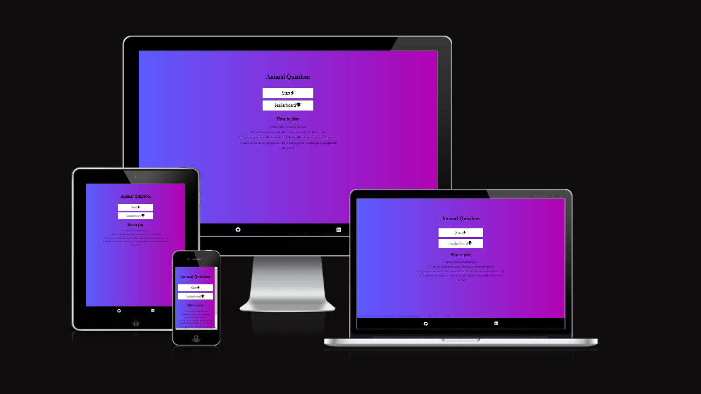

<h1>Animal Quizdom </h1>

Animal Quizdom is a general knowledge quiz I have created using HTML, CSS and JaveScript.
My goal is to create a fun and interactive experience for anyone that gives it a try. 
The topic will revolve around, you guessed it, the Animal Kingdom.
I hope to combine all the skills I have learned thus far to create a pleasant and engaging time on my site.

<h2> Features </h2>

<h3>General Layout</h3>

<h3>Home page</h3>

The home page will include a button for starting the game, and checking the leaderboard.
I plan to keep this page simple and understandable. I will also create a How To play section
to introduce players to the core concepts of the game.

<h3>Quiz Page</h3>

I plan to inculde a question counter, score, progressbar and a responsive questions and answers section
the goal is to keep everything very clear and easy to follow. I choose a purple and blue gradiant across the site which I think 
has very nice contrast

<h3> Leaderboard</h3>

The Leaderboard will include the ability to save your score and username,
and compare cores to previous games. This will provide a positive feedback loop were the player is 
encouraged to play again to beat their high score

<h2> Performance </h2>

I have tested my sites performance on Lighthouse and am happy with the results

<h2> Unfixed Bugs </h2>

Progressbar. I was unable to get this feature working properly despite the code seeming to not have issues.
Was unable to find and fix this issue

 404 showing when it should not. A rare bug were the 404 will be loaded instead of the end page

 Acess control error

<h2>Credits</h2>

Credits Content: The icons used in this project are from: <https://fontawesome.com> 

Media: The photos used in this project are from: <https://pixabay.com>

 General information learned on: <https://javascript.info>

 Guide on progressbar: <https://www.youtube.com/watch?v=oshknEcjvqo>

